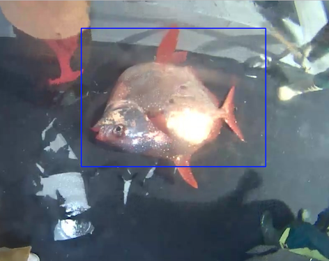

# Image Recognition - 6 Species of Fish
The problem to solve is to classify 6 species of fish in real world images with varying backgrounds

It applies Haar Cascade object detection algorithm and 16-layer Convolutional Neural Network.

The CNN has architecture similar to that of VGG-16, with different hyper-parameters.

It contains work by Ming Li for Kaggle Challenge.

